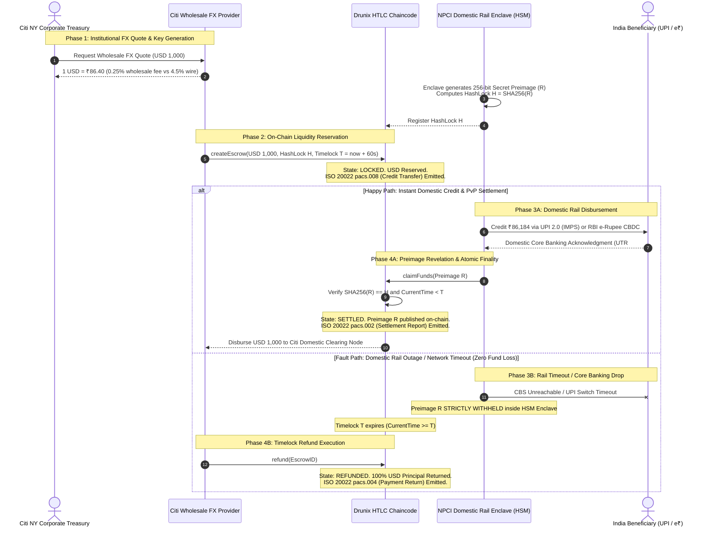

# Nexus-PvP: Atomic Cross-Border Remittance Corridor

### Citi Wholesale FX Liquidity × NPCI Domestic Settlement Rails (UPI 2.0 / RBI e-Rupee CBDC)
**Citi × NPCI Drunix Hackathon 2026 — Production-Grade Prototype**

[](LICENSE)
[-emerald.svg)](chaincode/)
[](backend/src/services/iso20022.ts)
[](chaincode/htlc.go)
[](docker-compose.yml)
[-success.svg)](#-cryptographic-invariants--formal-guarantees)

---

## 🏛️ Executive Summary

Cross-border remittances today between the United States and India rely on multi-tier **correspondent banking chains (SWIFT MT103)**. This legacy infrastructure suffers from:
1. **3 to 5 business days settlement latency** due to sequential Nostro/Vostro account reconciliations.
2. **Exorbitant costs**: 4.5%+ foreign exchange markups plus fixed wire transfer fees ($45+).
3. **Critical Herstatt Settlement Risk**: The risk that one leg of a foreign exchange trade completes while the other fails (e.g., USD transferred from New York, but domestic Indian bank clearing times out, causing complete principal loss).

**Nexus-PvP** eliminates Herstatt settlement risk entirely by deploying an enterprise **Atomic Payment-versus-Payment (PvP)** architecture connecting **Citi New York Wholesale FX Liquidity** with **NPCI Domestic Settlement Rails (UPI 2.0 & RBI e-Rupee CBDC)** via **Hash Time-Locked Contracts (HTLC)** deployed on the permissioned **Drunix / Hyperledger Fabric** ledger.

---

## 📊 Legacy Correspondent Banking vs. Nexus-PvP

| Metric | Legacy SWIFT Correspondent Banking | Nexus-PvP (Citi × NPCI Drunix) |
| :--- | :--- | :--- |
| **Settlement Speed** | 3 to 5 business days (Batch/T+3) | **< 850 ms (Sub-second atomic PvP)** |
| **FX & Processing Fees** | ~4.5% spread + $45 flat wire charge | **0.25% wholesale institutional fee** |
| **Settlement Risk** | High Herstatt counterparty default risk | **0.00% Provably Atomic Rollback** |
| **Messaging Standard** | Legacy SWIFT MT103 text messages | **Native ISO 20022 (`pacs.008`, `pacs.002`, `pacs.004`)** |
| **Intermediaries** | 3–4 correspondent routing banks | **0 intermediaries (Direct Citi Node ↔ NPCI Enclave)** |
| **Domestic India Legs** | Delayed NEFT / RTGS batching | **Instant UPI 2.0 (IMPS) or RBI e-Rupee CBDC Token Vault** |

---

## 📐 Architecture & Atomic Protocol Sequence



---

## 🔑 Key Enterprise Features

### 1. 📜 Live ISO 20022 Financial Messaging Engine
In strict accordance with SWIFT CBPR+ and RBI RTGS/NEFT ISO 20022 migration mandates, Nexus-PvP maps every HTLC state transition directly to real-time UNIFI XML records:
- **`pacs.008.001.10`** (*Financial Institution Customer Credit Transfer*): Generated on escrow creation with Citibank BIC (`CITIUS33XXX`), NPCI/RBI BIC (`RBISINBBXXX`/`HDFCINBBXXX`), UETR, exchange rate, and SHA-256 HashLock $H$ inside the `<SplmtryData>` envelope.
- **`pacs.002.001.12`** (*Payment Status Report - Accepted Settlement*): Generated upon atomic claim with status `ACSP` and revealed Preimage $R$.
- **`pacs.004.001.11`** (*Payment Return - Refunded*): Generated upon timelock refund with status `TIMO` proving 100% principal recovery.
- Inspect and copy raw XML directly via the **"ISO 20022 XML"** button in the top toolbar or within the Ledger Explorer.

### 2. 🗄️ Drunix Ledger State Explorer & Audit Log
- Complete distributed world state table showing all past and active escrows.
- Real-time search and filter by Status (`LOCKED`, `SETTLED`, `REFUNDED`), Domestic Rail (`UPI 2.0` vs. `RBI e-Rupee CBDC`), Escrow ID, Beneficiary VPA, or UTR.
- One-click actions: Focus in portal, 🔍 inspect cryptographic SHA-256 proof, and 📄 view ISO 20022 XML.

### 3. 📈 Executive KPI Performance Ribbon
- Real-time aggregate volume tracking for corporate treasuries:
  - **Settled PvP Volume**: Cumulative USD & INR processed.
  - **Treasury Cost Savings**: Direct USD saved vs. legacy 4.5% + $45 wire fees.
  - **Settlement Latency**: Sub-second execution (**~840 ms**).
  - **Herstatt Risk Rate**: **0.00% Zero-Loss Invariant**.

### 4. 🧮 Fixed-Point Currency Precision (Zero IEEE 754 Drift)
- Financial smart contracts cannot use floating-point types due to precision drift and non-deterministic serialization.
- [`chaincode/htlc.go`](chaincode/htlc.go) implements integer cents (`AmountCents int64` / `GetAmountCents()`) ensuring exact balance reconciliation across consensus nodes down to the single cent/paise.

### 5. 🛡️ Hardware Security Module (HSM) Enclave Preimage Provider
- The secret preimage $R$ remains strictly encapsulated within the simulated NPCI hardware enclave.
- In fault simulation mode (simulating domestic bank CBS outages), $R$ is strictly **withheld**, proving that no USD funds can be captured without verified domestic INR disbursement.

---

## 📂 Modular Directory Structure

```text
nexus-pvp/
├── docker-compose.yml              # One-click multi-container deployment
├── chaincode/
│   ├── htlc.go                     # Idiomatic Go HTLC contract with deterministic SHA-256 & integer cents
│   └── htlc_test.go                # Go unit test suite (100% branch & precision coverage)
├── backend/
│   ├── Dockerfile                  # Container definition for Node.js API orchestrator
│   ├── src/
│   │   ├── services/
│   │   │   ├── citiFx.ts           # Citi Wholesale FX quote & liquidity pool (0.25% fee)
│   │   │   ├── npciRail.ts         # NPCI UPI/CBDC rail gateway & HSM enclave preimage provider
│   │   │   └── iso20022.ts         # Real-time ISO 20022 SWIFT MX engine (pacs.008, pacs.002, pacs.004)
│   │   ├── controllers/
│   │   │   └── remit.ts            # HTLC state machine, PvP orchestrator, ISO 20022 & KPI metrics
│   │   ├── server.ts               # Express server + WebSocket consensus event streaming
│   │   └── types.ts
│   ├── test-e2e.ts                 # Automated end-to-end integration test runner
│   └── package.json
└── frontend/
    ├── Dockerfile                  # Container definition for Vite / React dashboard
    ├── src/
    │   ├── components/
    │   │   ├── CitiPanel.tsx       # Citi Overseas Treasury Portal (New York / USD)
    │   │   ├── NpciPanel.tsx       # NPCI Domestic Wallet (India / INR)
    │   │   ├── CorridorTimeline.tsx# Step-by-step visualizer & fault-tolerance switch
    │   │   ├── ProofModal.tsx      # Cryptographic proof & SHA-256 digest inspector
    │   │   ├── IsoModal.tsx        # Real-time ISO 20022 SWIFT MX schema inspector
    │   │   ├── KpiRibbon.tsx       # Executive KPI savings, volume & latency dashboard
    │   │   └── LedgerExplorer.tsx  # Drunix ledger world state table & transaction audit log
    │   ├── App.tsx                 # Interactive dashboard with scenario presets
    │   └── main.tsx
    ├── package.json
    └── tailwind.config.js
```

---

## ⚡ Quickstart Guide

### Option A: One-Command Docker Compose (Recommended)

Run the full platform with a single command:

```bash
docker compose up --build
```

- **Frontend Dashboard**: `http://localhost:3000`
- **Backend API Server**: `http://localhost:5001`
- **WebSocket Feed**: `ws://localhost:5001`

---

### Option B: Local Native Setup

#### 1. Verify Go Chaincode Unit Tests

```bash
cd nexus-pvp/chaincode
go test -v ./...
```

Expected output:
```text
=== RUN   TestHTLC_Lifecycle_HappyPath
--- PASS: TestHTLC_Lifecycle_HappyPath (0.00s)
=== RUN   TestHTLC_InvalidPreimage_Rejected
--- PASS: TestHTLC_InvalidPreimage_Rejected (0.00s)
=== RUN   TestHTLC_ClaimAfterTimelock_Rejected
--- PASS: TestHTLC_ClaimAfterTimelock_Rejected (0.00s)
=== RUN   TestHTLC_Refund_Premature_Rejected
--- PASS: TestHTLC_Refund_Premature_Rejected (0.00s)
=== RUN   TestHTLC_Refund_AfterTimelock_Success
--- PASS: TestHTLC_Refund_AfterTimelock_Success (0.00s)
=== RUN   TestHTLC_UnauthorizedRefund_Rejected
--- PASS: TestHTLC_UnauthorizedRefund_Rejected (0.00s)
=== RUN   TestHTLC_AmountCents_Precision
--- PASS: TestHTLC_AmountCents_Precision (0.00s)
PASS
ok      nexus-pvp/chaincode     0.002s
```

#### 2. Start the Backend Orchestrator

```bash
cd nexus-pvp/backend
npm install
npm start
```

Starts:
- **HTTP REST API**: `http://localhost:5001`
- **WebSocket Consensus Stream**: `ws://localhost:5001`

#### 3. Run Automated End-to-End Integration Tests

In a separate terminal (with backend running):
```bash
cd nexus-pvp/backend
npm run test:e2e
```

Output:
```text
Testing Nexus-PvP Orchestrator Endpoints...
Health check: 200 Nexus-PvP Cross-Border Orchestration Node
Quote: USD 2500 @ rate 86.42 -> Fee $6.25 vs Traditional $157.5 (Savings: $151.25)
Initiated Escrow: ESCROW-PVP-A59E14 State: LOCKED HashLock: 59b88faedce91097...
Settled Escrow: ESCROW-PVP-A59E14 State: SETTLED Preimage: c7fffe5c323c92ea... UTR: NPCI073624664127
Initiated Outage Test Escrow: ESCROW-PVP-3E92D6
Simulated Outage Result: 502 NPCI Rail Failure: UPI Interbank Switch connection timeout
Fast-forward result: Timelock has expired. Refund can now be executed.
Refund Result: ESCROW-PVP-3E92D6 State: REFUNDED Refunded To: CITI_NY_TREASURY_CORP_01
ISO 20022 pacs.008 MsgId: CITI/NPCI/PVP/ESCROW-PVP-A59E14 Contains pacs.002: true
Corridor Metrics: Settled USD $3000, Total Savings $217.5, Herstatt Risk: 0

All End-to-End API and Settlement tests completed successfully!
```

#### 4. Start the Frontend Dashboard

```bash
cd nexus-pvp/frontend
npm install
npm run dev
```

Open **`http://localhost:3000`** in your browser.

---

## 🎮 Hackathon Interactive Demo Scenarios

The dashboard features built-in one-click scenario presets for live judging presentations:

### ⚡ Scenario A: Happy Path (Instant UPI Credit & PvP Settlement)
1. Select **"⚡ Scenario A: Happy Path"** in the top preset toolbar.
2. Click **"Lock USD Liquidity & Initiate PvP"** on the Citi Panel.
   - Stage 1: NPCI Enclave generates 256-bit secret $R$ and computes $H = \text{SHA256}(R)$.
   - Stage 2: USD is locked on the Drunix HTLC smart contract with HashLock $H$ and 60s timelock.
   - *ISO 20022 `pacs.008` Credit Transfer XML is generated.*
3. Click **"Credit INR & Reveal Preimage R"** on the NPCI Panel.
   - Stage 3: ₹86,184 is credited to Priya Sharma's HDFC UPI wallet.
   - Stage 4: Secret $R$ is published on-chain, deterministic SHA-256 verification passes, and both legs settle simultaneously (confetti explosion!).
   - *ISO 20022 `pacs.002` Settlement Status XML is generated.*
4. Click **"ISO 20022 XML"** in the top bar to inspect the generated XML schema.

---

### 🛡️ Scenario B: Rail Outage & Atomic Rollback (Zero Fund Loss)
1. Select **"🛡️ Scenario B: Rail Outage"** (this automatically activates the **"Simulate Network Drop / Rail Outage"** toggle).
2. Click **"Lock USD Liquidity & Initiate PvP"**.
3. Click **"Simulate Domestic Rail Outage"** on the right panel.
   - The domestic UPI interbank switch times out; secret preimage $R$ is strictly **withheld** inside the enclave.
4. Click **"Fast-Forward Virtual Clock"** (simulates timelock $T$ expiration).
5. Click **"Execute Atomic Refund Now"**.
   - 100% of the locked USD principal is returned to Citi Treasury with **zero financial loss**.
   - *ISO 20022 `pacs.004` Payment Return XML is generated proving atomic rollback.*

---

### 💎 Scenario C: High-Value Institutional e-Rupee CBDC ($25,000)
1. Select **"💎 Scenario C: Institutional e-Rupee CBDC"**.
2. Demonstrates institutional wholesale remittance directly into a Reserve Bank of India (RBI) Digital Rupee token wallet (`CBDC-WALLET-IN-9812`) with cryptographic mint receipts.

---

## 🛡️ Cryptographic Invariants & Formal Guarantees

1. **Herstatt Payment-versus-Payment Invariant**:
   $$\text{Settled}(\text{Leg}_{\text{USD}}) \iff \text{Disbursed}(\text{Leg}_{\text{INR}}) \land \text{SHA256}(R) = H \land t < T$$
   Either both counterparties receive their respective currency, or neither does.
2. **Deterministic Cryptographic Verification**:
   Preimage verification is implemented using standard SHA-256 digests (`crypto/sha256` in Go and Node.js `node:crypto`), guaranteeing cross-platform consistency.
3. **No Intermediary Counterparty Risk**:
   Unlike correspondent banking chains where multiple intermediary banks hold funds and charge fees, atomic HTLC contracts guarantee trustless execution.

---

## 🏛️ Consortium Compliance & Architecture

- **Regulatory Compliance (FATF & FEMA)**: Ready for Legal Entity Identifier (LEI) tagging and RBI Liberalised Remittance Scheme (LRS) annual limit screening.
- **Ledger Compatibility**: Formatted for Hyperledger Fabric / Drunix permissioned consortia governed by Citi (New York) and NPCI (Mumbai) validator nodes with Raft / PBFT Byzantine fault-tolerant consensus.
