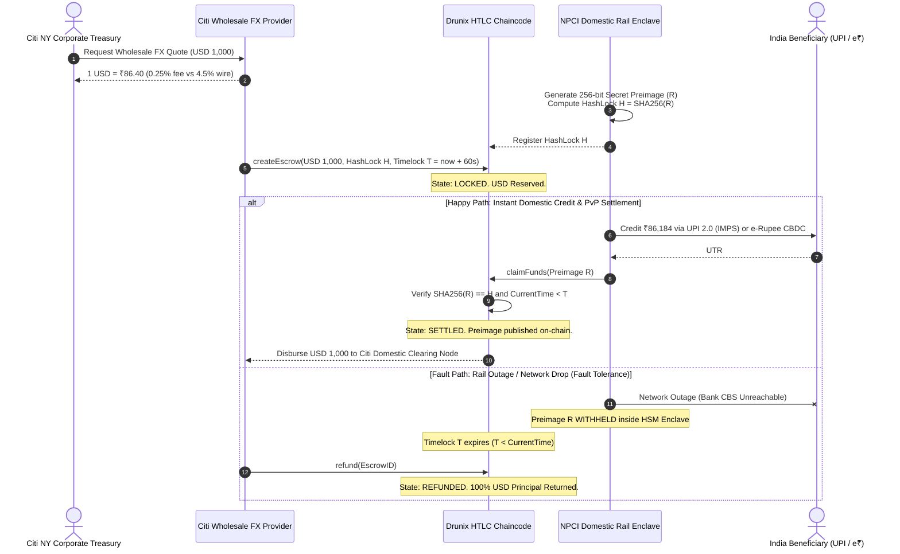

# Nexus-PvP: Atomic Cross-Border Remittance Corridor
### Citi Wholesale FX Liquidity × NPCI Domestic Settlement Rails (UPI / e-Rupee CBDC)
**Citi × NPCI Drunix Hackathon 2026 — Production-Grade Prototype**

---

## 🏛️ Executive Summary

Cross-border remittances today suffer from high friction: **3 to 5 business days settlement latency**, **4.5%+ FX markups**, fixed wire charges ($45+), and critical **Herstatt Settlement Risk** (the risk that one leg of a cross-border foreign exchange transaction settles while the other fails).

**Nexus-PvP** eliminates Herstatt risk entirely by implementing an enterprise **Atomic Payment-versus-Payment (PvP)** architecture connecting **Citi New York Wholesale FX Liquidity** with **NPCI Indian Domestic Settlement Rails (UPI 2.0 & RBI e-Rupee CBDC)** via **Hash Time-Locked Contracts (HTLC)** deployed on the permissioned **Drunix / Hyperledger Fabric** ledger.

---

## 📐 Architecture & Cryptographic Invariants



---

## 📂 Modular Directory Structure

```text
nexus-pvp/
├── chaincode/
│   ├── htlc.go             # Idiomatic Go HTLC contract with deterministic SHA-256 verification
│   └── htlc_test.go        # Go unit test suite (100% state & error branch coverage)
├── backend/
│   ├── src/
│   │   ├── services/
│   │   │   ├── citiFx.ts   # Citi Wholesale FX quote & liquidity provider (0.25% fee)
│   │   │   └── npciRail.ts # NPCI UPI/CBDC rail gateway & HSM enclave preimage provider
│   │   ├── controllers/
│   │   │   └── remit.ts    # HTLC state machine, PvP orchestrator & failure simulation
│   │   ├── server.ts       # Express server + WebSocket consensus event streaming
│   │   └── types.ts
│   ├── test-e2e.ts         # Automated end-to-end integration test runner
│   └── package.json
└── frontend/
    ├── src/
    │   ├── components/
    │   │   ├── CitiPanel.tsx         # Citi Overseas Treasury Portal (New York / USD)
    │   │   ├── NpciPanel.tsx         # NPCI Domestic Wallet (India / INR)
    │   │   ├── CorridorTimeline.tsx  # Step-by-step visualizer & fault-tolerance switch
    │   │   └── ProofModal.tsx        # Cryptographic proof & SHA-256 digest inspector
    │   ├── App.tsx                   # Interactive dashboard with scenario presets
    │   └── main.tsx
    ├── package.json
    └── tailwind.config.js
```

---

## ⚡ Quickstart Guide

### 1. Verify Go Chaincode & Run Tests

```bash
cd nexus-pvp/chaincode
go test -v ./...
```
Expected output:
```text
=== RUN   TestHTLC_Lifecycle_HappyPath
--- PASS: TestHTLC_Lifecycle_HappyPath (0.00s)
=== RUN   TestHTLC_InvalidPreimage_Rejected
--- PASS: TestHTLC_InvalidPreimage_Rejected (0.00s)
=== RUN   TestHTLC_ClaimAfterTimelock_Rejected
--- PASS: TestHTLC_ClaimAfterTimelock_Rejected (0.00s)
=== RUN   TestHTLC_Refund_Premature_Rejected
--- PASS: TestHTLC_Refund_Premature_Rejected (0.00s)
=== RUN   TestHTLC_Refund_AfterTimelock_Success
--- PASS: TestHTLC_Refund_AfterTimelock_Success (0.00s)
=== RUN   TestHTLC_UnauthorizedRefund_Rejected
--- PASS: TestHTLC_UnauthorizedRefund_Rejected (0.00s)
PASS
```

### 2. Start the Backend Orchestrator

```bash
cd nexus-pvp/backend
npm start
```
Starts:
- **HTTP REST API**: `http://localhost:5001`
- **WebSocket Server**: `ws://localhost:5001`

To run the automated end-to-end test against a running backend:
```bash
npm run test:e2e
```

### 3. Start the Frontend Dashboard

```bash
cd nexus-pvp/frontend
npm run dev
```
Open **`http://localhost:3000`** in your browser.

---

## 🎮 Hackathon Interactive Demo Scenarios

The dashboard features built-in one-click scenario presets:

### ⚡ Scenario A: Happy Path (Instant UPI Credit & PvP Settlement)
1. Select **"⚡ Scenario A: Happy Path"** in the top toolbar.
2. Click **"Lock USD Liquidity & Initiate PvP"** on the Citi Panel.
   - Stage 1: NPCI Enclave generates 256-bit secret $R$ and computes $H = \text{SHA256}(R)$.
   - Stage 2: USD is locked on the Drunix HTLC smart contract with HashLock $H$ and 60s timelock.
3. Click **"Credit INR & Reveal Preimage R"** on the NPCI Panel.
   - Stage 3: ₹86,184 is credited to Priya Sharma's HDFC UPI wallet.
   - Stage 4: Secret $R$ is published on-chain, deterministic SHA-256 verification passes, and both legs settle simultaneously (confetti explosion!).

### 🛡️ Scenario B: Rail Outage & Atomic Rollback (Zero Fund Loss)
1. Select **"🛡️ Scenario B: Rail Outage"** (this automatically activates the **"Simulate Network Drop / Rail Outage"** toggle).
2. Click **"Lock USD Liquidity & Initiate PvP"**.
3. Click **"Simulate Domestic Rail Outage"** on the right panel.
   - The domestic UPI interbank switch times out; secret preimage $R$ is strictly **withheld** inside the enclave.
4. Click **"Fast-Forward Virtual Clock"** (simulates timelock $T$ expiration).
5. Click **"Execute Atomic Refund Now"**.
   - 100% of the locked USD principal is returned to Citi Treasury with **zero financial loss**.

### 💎 Scenario C: High-Value Institutional e-Rupee CBDC ($25,000)
1. Select **"💎 Scenario C: Institutional e-Rupee CBDC"**.
2. Demonstrates institutional wholesale remittance directly into a Reserve Bank of India (RBI) Digital Rupee token wallet (`CBDC-WALLET-IN-9812`) with cryptographic mint receipts.

---

## 🛡️ Enterprise Security & Guarantees

1. **Herstatt PvP Invariant**: Funds can only transfer if the matching leg also executes. Either both counterparties receive their respective currency, or neither does.
2. **Deterministic Cryptographic Verification**: Standard SHA-256 verification guarantees preimage integrity regardless of ledger architecture.
3. **No Intermediary Counterparty Risk**: Unlike correspondent banking chains (where 3+ correspondent banks take cut fees and introduce failure points), atomic HTLC contracts guarantee trustless execution.
